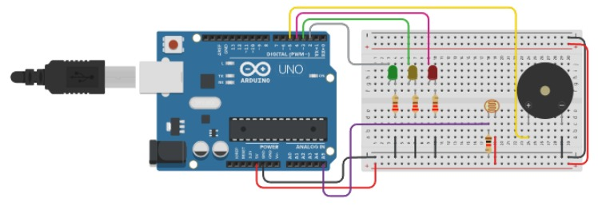

# checkpoint-1-Edge-computing

# 🌞 Sistema de Monitoramento de Luminosidade com Arduino

Projeto desenvolvido com Arduino que utiliza um **fotorresistor (LDR)** para medir a intensidade da luz ambiente, indicando o nível por meio de LEDs e acionando um buzzer em situações de alta luminosidade.

---

## 📌 Descrição

O sistema realiza a leitura da luz ambiente e responde da seguinte forma:

* 🟢 **Baixa luminosidade** → LED verde pisca
* 🟡 **Luminosidade média** → LED amarelo pisca
* 🔴 **Alta luminosidade** → LED vermelho acende + buzzer é ativado por 3 segundos

Esse tipo de projeto pode ser aplicado em:

* Sistemas de alerta
* Automação residencial
* Monitoramento ambiental

---

## 🛠️ Componentes Utilizados

* 1x Arduino Uno
* 1x Fotorresistor (LDR)
* 3x LEDs (verde, amarelo e vermelho)
* 3x Resistores (220Ω)
* 1x Resistor (1kΩ)
* 1x Buzzer
* Jumpers
* Protoboard

---

## ⚙️ Funcionamento

O LDR é utilizado em um **divisor de tensão**, permitindo que o Arduino leia variações de tensão proporcionalmente à luminosidade através de uma porta analógica.

Com base nesses valores, o sistema executa ações específicas:

* Valores baixos (menores que 200) → ambiente escuro → LED verde
* Valores médios (entre 200 e 500) → LED amarelo
* Valores altos (maiores que 500) → ambiente muito iluminado → LED vermelho + buzzer

---

## 📊 Faixas de leitura

| Luminosidade | Valor analógico | Ação                  |
| ------------ | --------------- | --------------------- |
| Baixa        | < 200           | LED verde             |
| Média        | 200 – 500       | LED amarelo           |
| Alta         | > 500           | LED vermelho + buzzer |

---

## 🔌 Esquema de Ligação (resumo)

* LDR conectado ao pino analógico **A5**, formando um divisor de tensão
* LEDs conectados a pinos digitais com resistores de proteção
* Buzzer conectado a um pino digital

---

## 🧪 Código

O código completo está disponível no arquivo:

```
codigo.ino
```

---

## 🖼️ Circuito



---

## 🎥 Demonstração

(Adicione aqui o link do vídeo, se houver)

---

## 🚀 Como executar

1. Monte o circuito conforme o esquema
2. Abra o código na IDE do Arduino
3. Faça o upload para a placa
4. Observe o comportamento dos LEDs e do buzzer conforme a luz ambiente

---

## ✨ Funcionalidades

* Leitura de luminosidade em tempo real
* Feedback visual com LEDs
* Alerta sonoro em alta luminosidade
* Sistema simples e eficiente para aprendizado de sensores

---

## 📚 Possíveis melhorias

* Ajuste dinâmico dos limites de luminosidade
* Uso de display LCD para exibição dos valores
* Integração com IoT
* Controle de intensidade dos LEDs com PWM

---

## 👤 Autor

Matheus Monteiro
